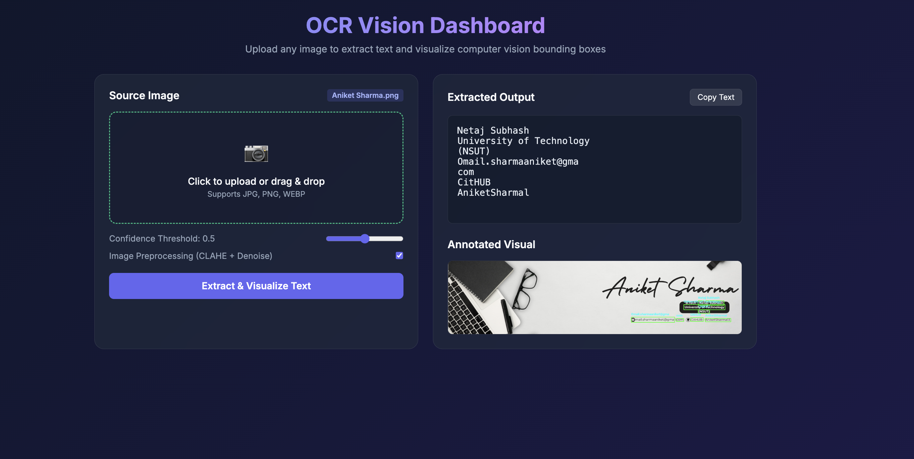

# Computer Vision & EasyOCR FastAPI Service 🚀

An end-to-end Computer Vision OCR (Optical Character Recognition) application powered by **OpenCV**, **EasyOCR**, and **FastAPI**. It includes image preprocessing (Grayscale + CLAHE contrast enhancement + Bilateral noise filtering), text detection, bounding box visualization, and an interactive Web Dashboard.

---
## Web Dashboard Preview :D - 


## 📁 Project Architecture

```text
CV Project/
├── backend/
│   ├── ocr_engine.py       # Core EasyOCR extraction engine
│   ├── preprocessing.py    # CLAHE & Bilateral image enhancement
│   └── utils.py            # Bounding box visualizer & fallback renderer
├── test_images/            # Sample images for testing
├── test_ocr/
│   └── test_ocr.py         # Batch OCR evaluation test runner
├── main.py                 # FastAPI Web Server & Dashboard UI
├── requirements.txt        # Project dependencies
└── README.md               # Project documentation
```

---

## 🛠️ Installation & Setup

1. **Clone the repository**:
   ```bash
   git clone https://github.com/YOUR_USERNAME/YOUR_REPOSITORY_NAME.git
   cd YOUR_REPOSITORY_NAME
   ```

2. **Create and activate a virtual environment**:
   ```bash
   python3 -m venv .venv
   source .venv/bin/activate
   ```

3. **Install dependencies**:
   ```bash
   pip install -r requirements.txt
   ```

---

## 🚀 Running the Web Application

Start the FastAPI server:

```bash
uvicorn main:app --reload
```

- **Interactive Web Dashboard**: Navigate to `http://127.0.0.1:8000` in your web browser to upload images, view extracted text, copy text to clipboard, and view annotated bounding box visuals.
- **API Documentation**: Interactive Swagger docs are available at `http://127.0.0.1:8000/docs`.

---

## 🧪 Running Batch OCR Tests

To run OCR evaluation on all images inside `test_images/`:

```bash
python3 test_ocr/test_ocr.py
```
